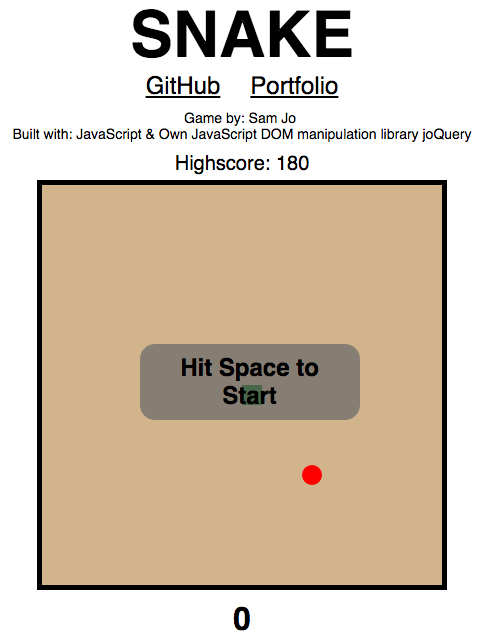

## joQuery

A light-weight library to manage core DOM manipulation functionality, making AJAX requests, and event handling. Implemented using the native DOM API to ensure cross-browser compatibility.

[Demonstrated with an rendition of the classic game Snake!][Snake]
[Snake]: https://samueljo.github.io/joQuery/



### How To Use

Download `./joQuery/lib/` and include it in project directory. Wherever joQuery is used, include the following line at the top of the file:
```javascript
const $jo = require('./../joQuery/lib/main');
```

### Methods

#### $jo

```javascript
// $jo('<tag>') will create an HTML element with the tag and return a DOMNodeCollection object
const $li = $jo('<li>');

// $jo('tag') and $jo('.klass') will collect all matching nodes from the page and return a DOMNodeCollection object
const collection = $jo('li');
const collection = $jo('.snake');

// If argument is an instance of HTMLElement, function returns native HTMLElement wrapped in joQuery, returning a DOMNodeCollection
const collection = $jo(HTMLElement);

// If argument is a function, will push function into a queue to be executed on `document` `ready`
$jo(func);


// Merges two or more JavaScript objects
$jo.extend(objA, objB, objC);

// Receives an options object argument and sends an AJAX request with native JavaScript using an XHR, or XMLHttpRequest objectg
$jo.ajax(options);
```

#### `DOMNodeCollection.prototype` Methods

##### `html`
* `html` receives an optional string as an argument
* With argument: the string will be the `innerHTML` of each node
* Without argument: returns `innerHTML` of the first node

#### `empty`
* Clears all nodes in the collection array

#### `append`
* Accepts a joQuery wrapped collection, an HTML element, or a string
* Appends the `outerHTML` of each element in argument to `innerHTML` of each element in the node collection

#### `attr`
* Getter method for values of an attribute for the first element from array of matched elements
* Acts as a setter method if a second argument of value is passed in

#### `addClass`
* Takes a class as an argument and adds it to HTML elements in the node collection
* Can accept multiple classes like so:
```javascript
const $h3 = $jo('<h3>');
$h3.addClass('notice start');
$h3.text('Hit Space to Start');
this.$jo.append($h3);
```

#### `removeClass`
* Takes a single class as an argument and removes it from the HTML elements in the node collection
```javascript
$jo('li').removeClass('snake-head');
$jo('li').removeClass('snake');
$jo('li').removeClass('apple');
```

#### `children`
* Returns a node collection of all children of all nodes in the array

#### `parent`
* Returns a node collection of the `parent`s of each of the nodes

#### `find`
* Accepts a selector as an argument and returns a matching node collection

#### `remove`
* Removes the html of all the nodes in the collection from the DOM

#### `on`
* Accepts an event and a callback and adds the event handler from every element in the node array

#### `off`
* Accepts an event and a callback and removes the event handler from every element in the node array

#### `text`
* Accepts a string and adds it to the HTML element text content

#### `get`
* Takes in an index and fetches the HTML element at that index from the node collection
